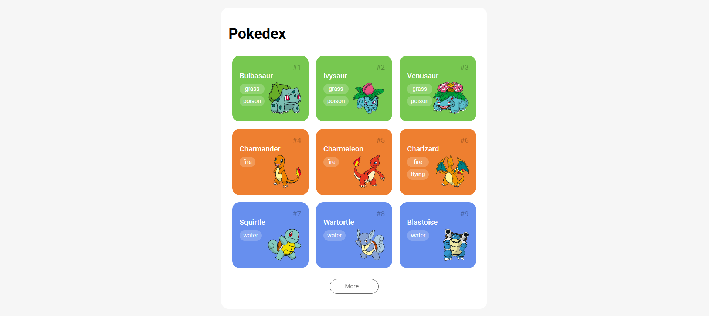

# POKEDEX #

## 📝 Descrição do projeto ##

Esse projeto é uma listagem de Pokemons da primeira geração, feito de forma dinâmica. Foi realizado para o curso "Primeiras páginas interativas com JavaScript", disponibilizado pela 
<a href="https://web.dio.me/track/potencia-tech-angular-developer-powered-ifood"> DIO</a>.

## 🔧 Ferramentas e tecnologias ##

* HTML
* CSS
* JavaScript
* [PokeAPI](https://pokeapi.co/)</a>
* Pokedex App por Saepul Nahwan no [Dribbble](https://dribbble.com/shots/6540871-Pokedex-App#)

## 📌 Funcionalidades ##

Integração com a API PokeAPI para listagem dinâmica de Pokemons. 

Por padrão, são exibidos 9 ao carregar a página, mas é possível clicar no botão "more..." para carregar os próximos 9.

Após os 151 primeiros Pokemons, o botão de carregar é retirado, pois é atingido o limite da primeira geração.

A página é responsiva, funcionando em celulares, tablets e desktop.

## 🚶 Acesso ##

Deploy disponível no [Vercel](https://pokedex-brusoncini.vercel.app/)</a>.

## 👩🏻‍💻 Feito por ##

Desenvolvido com ♥ por [Bruna Soncini](www.linkedin.com/in/brunasoncini/).

